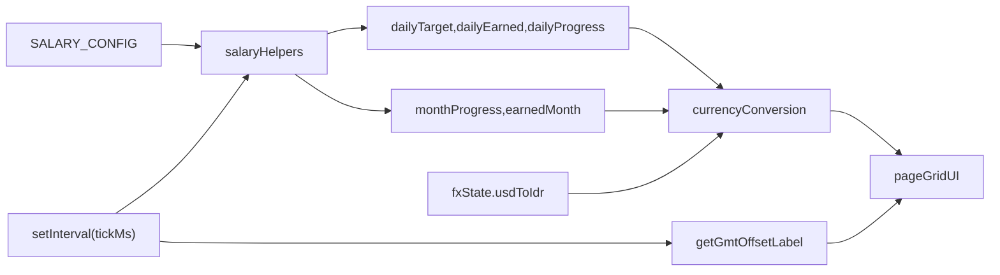

# Tech Solution: Daily Earning and Daily Progress

## Objective

Implement daily earning metrics, dual daily progress indicators, GMT offset display, and a responsive dashboard grid using `shadcn/ui + Tailwind`.

## Likely Failure Sources and Validation

Potential sources reviewed:

1. day progress calculation across local midnight
2. day target calculation when month day-count changes
3. timezone label formatting inconsistency across browsers
4. FX conversion consistency between base salary currency modes
5. percentage clamping for progress bars
6. hydration timing (`now` null on first render)
7. layout regression from linear stack to grid spans

Most likely to break behavior:

- date math around day/month boundaries
- timezone offset representation consistency

Validation logs to de-risk assumptions before and during QA:

- gated debug logs via `NEXT_PUBLIC_DEBUG_SALARY=1`
- include timestamp ISO, GMT label, month/day progress, daily target, daily earned, FX state
- log once per minute to avoid noise
- verify at four checkpoints:
  - start of day
  - midday
  - near midnight
  - month rollover

## Architecture and Data Flow

## Formula Definitions

- `daysInMonth = new Date(year, month + 1, 0).getDate()`
- `dailyTarget = monthlySalary / daysInMonth`
- `dayTimeProgress = elapsedMsSinceLocalMidnight / totalMsInCurrentLocalDay`
- `dailyEarned = dailyTarget * dayTimeProgress`
- `dailyEarningProgress = clamp(dailyEarned / dailyTarget, 0, 1)`
- `monthlyEarned = monthlySalary * monthProgress`

## Code Changes

### 1) `shadcn/ui` baseline

- Add `components.json` to define shadcn aliases and CSS entry.
- Add `lib/utils.ts` with `cn()` helper (`clsx + tailwind-merge`).
- Add UI primitives:
  - `components/ui/card.tsx`
  - `components/ui/progress.tsx`
  - `components/ui/badge.tsx`
  - `components/ui/separator.tsx`
- Add dependencies:
  - `class-variance-authority`
  - `clsx`
  - `tailwind-merge`
  - `@radix-ui/react-progress`
  - `@radix-ui/react-separator`

### 2) Salary utility expansion

In `lib/salary.ts`:

- add `getDaysInMonth(now)`
- add `getDayProgress(now)`
- add `getDailyTarget(monthlySalary, now)`
- add `calculateDailyEarned(dailyTarget, progress)`

### 3) UI and feature composition

In `app/page.tsx`:

- compute daily + monthly values in source currency
- convert values into USD/IDR using existing FX flow
- render new dashboard cards:
  - clock + GMT badge
  - earned today
  - daily progress (time + earning bars)
  - month progress
  - earned this month
  - monthly total
  - exchange rate
- change layout to responsive `N x M` grid (`1 col mobile`, `2 cols md`, `3 cols xl`)

### 4) Docs

- add PRD document
- add this technical solution document
- update README feature + stack sections

## Testing Strategy

### Automated

- add `vitest` unit tests for `lib/salary.ts`:
  - day progress at start/mid/end of day
  - days in month for leap and non-leap scenarios
  - daily target and earned computations
  - progress clamping expectations

### Manual

- verify UI with `SALARY_CONFIG.currency = 'USD'`
- verify UI with `SALARY_CONFIG.currency = 'IDR'`
- validate GMT label matches local system timezone
- verify desktop/tablet grid is non-linear and scan-friendly
- validate midnight/day rollover behavior via mocked dates or temporal checks

## Complexity

- Time complexity per tick: `O(1)`
- Space complexity: `O(1)` runtime state

The feature is compute-light and fit for frequent tick updates.
