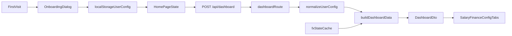

# Tech Solution: Browser-Persisted User Config

## Objective

Replace hardcoded runtime salary and spending values with browser-persisted user input while keeping the current server-side dashboard calculation model intact. The implementation should:

- collect monthly salary and monthly spending on first visit
- persist those values in the browser
- send user config to the dashboard API
- remove the read-only `Runtime Config` card
- add a derived `Estimated Daily Spending` card
- stay visually aligned with the current `shadcn` setup

## Current Architecture

The current flow is straightforward:

- [app/page.tsx](C:\Users\PC\Documents\Code\Personal\ed-live-salary\app\page.tsx) fetches `/api/dashboard` with timezone metadata and renders the dashboard tabs.
- [app/api/dashboard/route.ts](C:\Users\PC\Documents\Code\Personal\ed-live-salary\app\api\dashboard\route.ts) passes request context into [lib/server/dashboard.ts](C:\Users\PC\Documents\Code\Personal\ed-live-salary\lib\server\dashboard.ts).
- [lib/server/dashboard.ts](C:\Users\PC\Documents\Code\Personal\ed-live-salary\lib\server\dashboard.ts) computes salary, finance, FX, and config output from [lib/config.ts](C:\Users\PC\Documents\Code\Personal\ed-live-salary\lib\config.ts).
- [lib/contracts/dashboard.ts](C:\Users\PC\Documents\Code\Personal\ed-live-salary\lib\contracts\dashboard.ts) defines the DTO shape consumed by the page.

The current design is clean, but `lib/config.ts` is still the runtime source of truth. That is the main thing that needs to change.

## Recommended Approach

Keep the existing server-side calculation engine. Do not move finance and salary math into the client.

Instead:

1. Store user config in the browser with `localStorage`.
2. Load and validate that config in `app/page.tsx` before dashboard fetches begin.
3. Send the validated config to `/api/dashboard` in the request body.
4. Have the server normalize and calculate from request-provided config instead of hardcoded runtime constants.
5. Keep `lib/config.ts` only as fallback defaults and schema-level constants.

This is the best trade-off because it preserves the working calculation pipeline, limits regression risk, and avoids duplicating business logic on the client.

## Why `POST` Is Better Than Extending `GET`

There are a few ways to bridge browser storage into the server:

1. Keep `GET` and pass config through query params.
2. Keep `GET` and rebuild salary/finance math in the client.
3. Move dashboard fetches to `POST` and send config as JSON.

The best option is `POST` with JSON.

Reasons:

- query params are awkward for multi-field numeric config
- request bodies are easier to validate and evolve
- config data becomes explicit request input instead of URL plumbing
- the current server-side math stays reusable

## Proposed Data Flow



## Proposed Data Model

### Browser-persisted config

Recommend introducing a dedicated user-config shape, separate from `DashboardDto`:

```ts
type StoredUserConfig = {
  version: 1;
  salaryAmount: number;
  salaryCurrency: 'USD' | 'IDR';
  monthlySpendingAmount: number;
  monthlySpendingCurrency: 'USD' | 'IDR';
  updatedAt: string;
};
```

This should live in a focused helper like `lib/user-config.ts` so parsing, validation, and storage keys are not scattered through `app/page.tsx`.

### Request payload

Recommend changing the dashboard request contract to something like:

```ts
type DashboardRequestDto = {
  clientTimezone: string | null;
  clientOffsetMinutes: number | null;
  config: StoredUserConfig;
};
```

### Response payload

Keep `DashboardDto` as the main response shape, but extend it where needed:

- keep `config` for active runtime values
- add finance fields for `estimatedDailySpendingUSD` and `estimatedDailySpendingIDR`
- optionally add a `configSource` or equivalent diagnostics field if temporary debugging needs it

## File-Level Changes

### [app/page.tsx](C:\Users\PC\Documents\Code\Personal\ed-live-salary\app\page.tsx)

- Load stored config from the browser during bootstrap.
- Block dashboard fetching until config bootstrap completes.
- Show onboarding when stored config is missing or invalid.
- Send a `POST` request to `/api/dashboard` with timezone metadata and normalized user config.
- Remove the read-only `Runtime Config` card.
- Replace it with editable config UI and reset capability.
- Add the new `Estimated Daily Spending` card in the finance area.
- Keep the UI on current `shadcn` patterns. If needed, add `Dialog`, `Input`, `Label`, `Select`, `Button`, or `AlertDialog` through the same `shadcn` approach.

### [app/api/dashboard/route.ts](C:\Users\PC\Documents\Code\Personal\ed-live-salary\app\api\dashboard\route.ts)

- Add `POST` handler support.
- Parse request JSON instead of only query params.
- Validate incoming config shape and reject malformed input with `400`.
- Keep debug logging, but extend it to include config validation and normalization signals.

### [lib/server/dashboard.ts](C:\Users\PC\Documents\Code\Personal\ed-live-salary\lib\server\dashboard.ts)

- Stop depending directly on `SALARY_CONFIG` and `FINANCE_CONFIG` for request-driven calculations.
- Accept normalized config through `BuildDashboardParams`.
- Continue using the same timezone normalization and FX loading behavior.
- Compute finance values from request config.
- Add derived `estimatedDailySpending` fields using the same `localNow` context that already drives progress calculations.

### [lib/contracts/dashboard.ts](C:\Users\PC\Documents\Code\Personal\ed-live-salary\lib\contracts\dashboard.ts)

- Add request DTO types for the `POST` contract.
- Extend `DashboardFinanceDto` with:
  - `estimatedDailySpendingUSD`
  - `estimatedDailySpendingIDR`
- Keep `DashboardConfigDto` aligned with active runtime values returned by the server.

### [lib/config.ts](C:\Users\PC\Documents\Code\Personal\ed-live-salary\lib\config.ts)

- Keep only stable defaults like:
  - fallback salary/spending values
  - `tickMs`
  - `fxRefreshMs`
  - possibly schema defaults
- Do not treat this file as the runtime source of truth once user config exists.

### Recommended new helper files

- `lib/user-config.ts`
  - storage key
  - parse/validate helpers
  - normalization
  - reset/save/load helpers
- `components/user-config-dialog.tsx` or equivalent
  - onboarding form UI
  - can also be reused inside the Config tab if desired

## Derived Daily Spending Formula

Use the current salary utility semantics from [lib/salary.ts](C:\Users\PC\Documents\Code\Personal\ed-live-salary\lib\salary.ts), which already exposes `getDaysInMonth(now)`.

Recommended formula:

- `estimatedDailySpendingSource = monthlySpendingSource / daysInCurrentMonth(localNow)`

Currency handling should follow the same branch logic already used for salary and monthly spending:

- if spending source currency is `USD`, convert to `IDR` with `fxState.usdToIdr`
- if spending source currency is `IDR`, convert to `USD` by dividing by `fxState.usdToIdr`

This keeps the logic readable and consistent with the rest of the file.

## Failure Analysis

I’d sanity-check these six possible failure sources before treating this as a simple UI task:

1. stored browser config is missing, corrupted, or from an old schema version
2. salary or spending currency normalization flips the wrong conversion branch
3. first fetch runs before browser config bootstrap finishes
4. stale or fallback FX rate hides conversion mistakes
5. estimated daily spending uses the wrong month length near timezone boundaries
6. removing the runtime config card leaves users with no obvious edit/reset path

### Most likely sources

The two most likely issues are:

1. bootstrap timing mismatch between browser storage restore and the first dashboard request
2. currency normalization bugs when converting request-provided values into dual-currency display fields

These are the ones most likely to create subtle incorrect output while the UI still appears "fine."

## Validation Logs Before Full Fix

Per the migration risk, add temporary logs first to validate assumptions before locking behavior:

### Client logs

- On storage load:
  - raw stored payload
  - validation result
  - schema version
  - whether onboarding will be shown
- Before dashboard request:
  - salary amount/currency
  - monthly spending amount/currency
  - timezone
  - offset minutes
  - config source: restored or newly submitted

### Server logs

- After request parsing:
  - normalized salary config
  - normalized spending config
  - timezone inputs
  - whether request was rejected or accepted
- After dashboard computation:
  - monthly spending in both currencies
  - estimated daily spending in both currencies
  - disposable income
  - savings rate
  - FX rate and stale state

The existing debug hooks in [app/page.tsx](C:\Users\PC\Documents\Code\Personal\ed-live-salary\app\page.tsx), [app/api/dashboard/route.ts](C:\Users\PC\Documents\Code\Personal\ed-live-salary\app\api\dashboard\route.ts), and [lib/use-animated-numbers.ts](C:\Users\PC\Documents\Code\Personal\ed-live-salary\lib\use-animated-numbers.ts) already establish a debug-friendly pattern, so extending that approach is the clean move.

## UI Composition

The UI should stay in the current design system lane:

- reuse existing `Card`, `Tabs`, `Badge`, `Separator`, and related spacing patterns
- use `shadcn` primitives for onboarding and config editing
- keep styling token usage consistent with current classes and dark-mode handling

If the current setup does not include needed primitives yet, importing additional `shadcn` components is fine. That is still more consistent than inventing custom one-off form scaffolding.

## Testing Strategy

### Unit tests

Add or update tests around:

- config validation and normalization
- `POST` request parsing and `400` behavior for invalid config
- estimated daily spending for `28`, `29`, `30`, and `31` day months
- currency conversion for salary and spending in both `USD` and `IDR`
- preserved finance metrics after config migration

### Manual QA

- first visit with no stored config shows onboarding
- valid onboarding submission stores config and loads dashboard
- revisit restores config without showing onboarding
- invalid stored config falls back to onboarding instead of broken UI
- Config tab can edit and save existing values
- Config reset clears storage and reopens onboarding
- salary in `USD`, spending in `USD`
- salary in `IDR`, spending in `IDR`
- salary in `USD`, spending in `IDR`
- salary in `IDR`, spending in `USD`
- estimated daily spending changes correctly when month length changes
- UI still feels native to the current `shadcn` styling baseline

## Complexity

- Time complexity per request remains `O(1)`
- Browser storage overhead remains `O(1)`
- Runtime risk is mostly around validation and bootstrap sequencing, not algorithmic cost

This is a low-compute feature. The real challenge is correctness and state flow, not performance.
